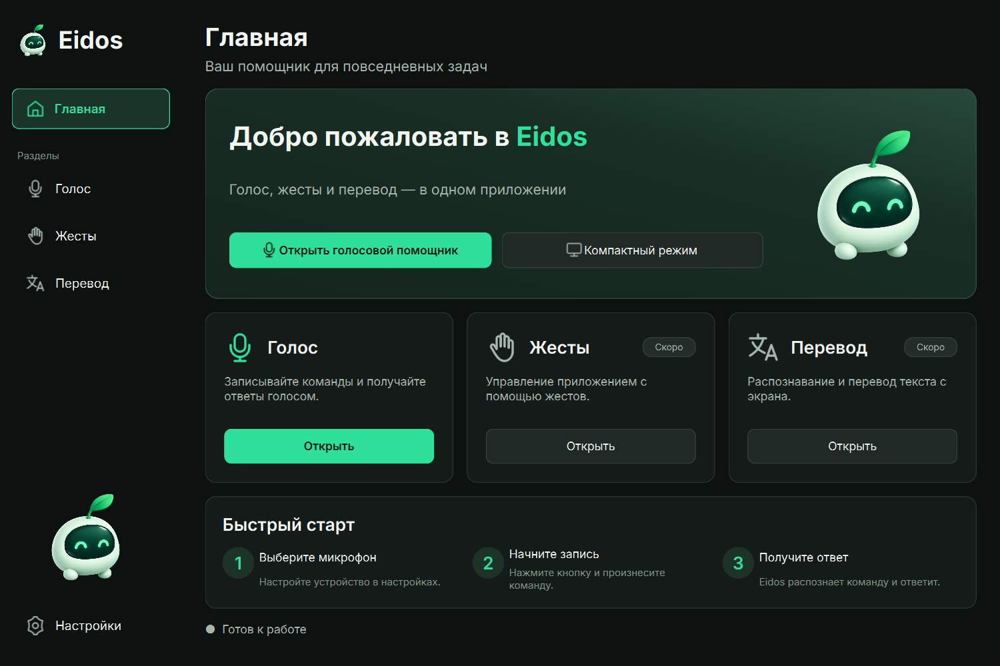

# Eidos — первый MVP для Windows

Русскоязычный настольный ассистент на **Python 3.11 / PyQt6**. Реализованы
каркас приложения и голосовой цикл с активацией кнопкой. Жесты и перевод
экрана показывают «Модуль пока не подключён»; доступны интерфейсы для будущих адаптеров.



## Интерфейс по референсам

Пять отдельных страниц переключаются через постоянное боковое меню:
«Главная», «Голос», «Жесты», «Перевод», «Настройки». Окно 1200×800 можно
изменять; при уменьшении карточки перестраиваются вертикально и прокручиваются.
Шрифт Inter, 19 SVG-иконок и прозрачный маскот с четырьмя выражениями хранятся
внутри проекта. Inter распространяется с лицензией OFL в assets/fonts.

- Главная: переходы к модулям, быстрый старт и компактный режим.
- Голос: реальный выбор микрофона, запись/остановка одной кнопкой, реальные
  результаты, копирование, озвучивание и сворачиваемый журнал «Подробности».
- Жесты и Перевод: подготовленные страницы, управление камерой и выбор области
  отключены. Камера и захват экрана не запускаются.
- Настройки: изменения применяются кнопкой «Сохранить». «Сбросить» запрашивает
  подтверждение и сохраняет значения по умолчанию. Работают выбор микрофона,
  Whisper и CPU/CUDA, озвучивание, голоса Светлана/Дмитрий, режим поверх окон и
  отключение анимации маскота. Микрофон и озвучивание на странице «Голос»
  сохраняются сразу и синхронизируются с настройками.

Маскот показывает готовность, слушание, обработку и ошибку. Анимация конечная,
только при смене состояния, и останавливается при скрытии страницы. Постоянного
таймера перерисовки нет. Автозапуск, светлая тема, смена акцента и дополнительные
языки интерфейса не реализованы: соответствующие параметры отключены или
показаны как фиксированные. Стандартная рамка Windows сохраняет системные resize/snap.

Клавиатура: Tab/Shift+Tab, Space/Enter для кнопок, Ctrl+1…Ctrl+5 для разделов.
Длинные имена микрофонов отображаются с многоточием и полной подсказкой.

Снимки: [Главная](docs/screenshots/normal/home.png),
[Голос](docs/screenshots/normal/voice.png),
[Жесты](docs/screenshots/normal/gestures.png),
[Перевод](docs/screenshots/normal/translation.png),
[Настройки](docs/screenshots/normal/settings.png).
Отчёт об обновлении интерфейса — [docs/ui-verification.md](docs/ui-verification.md).

## Быстрый запуск в подготовленной папке

В этой папке уже установлены Python 3.11.17 и зависимости в `.venv`:

```powershell
Set-Location 'C:\Users\Элдос\Desktop\Eidos'
& .\.venv\Scripts\python.exe -m eidos
```

Чтобы использовать требуемую команду `python -m eidos` без активации скриптом:

```powershell
Set-Location 'C:\Users\Элдос\Desktop\Eidos'
$env:PATH = "$PWD\.venv\Scripts;$env:PATH"
python -m eidos
```

Виртуальное окружение привязано к этой папке. После переноса проекта создайте его заново.

## Установка с нуля в PowerShell

Установите 64-битный Python 3.11 с python.org с Python Launcher. Затем:

```powershell
Set-Location 'C:\Users\Элдос\Desktop\Eidos'
py -3.11 -m venv .venv
& .\.venv\Scripts\python.exe -m pip install --upgrade pip
& .\.venv\Scripts\python.exe -m pip install -r requirements-dev.txt
& .\.venv\Scripts\python.exe -m eidos
```

`requirements.txt` устанавливает приложение и голосовые зависимости;
`requirements-dev.txt` дополнительно устанавливает pytest. Для воспроизведения
проверенного набора версий вместо них используйте `requirements-lock.txt`:

```powershell
& .\.venv\Scripts\python.exe -m pip install -r requirements-lock.txt
```

Только UI и заглушки, без голосовых библиотек:

```powershell
& .\.venv\Scripts\python.exe -m pip install -e .
```

Vision/OCR, Ollama/OpenAI, PyTorch и CUDA-пакеты не устанавливаются.
В Windows sounddevice wheel включает PortAudio. Системный FFmpeg для STT
не нужен: PyAV поставляется с библиотеками декодирования.

## Голосовой сценарий

1. В разделе «Настройки» выберите микрофон, модель и озвучивание. По умолчанию
   используются системный микрофон, Whisper `base`, CPU с `int8` и русский голос
   `ru-RU-SvetlanaNeural`. Если `int8` не поддерживается, выбирается `float32`.
2. В разделе «Голос» нажмите «Начать запись» и дождитесь статуса «Запись…».
3. Скажите «Привет», «Который час?», «Какая сегодня дата?» или «Помощь».
4. Нажмите «Остановить». Микрофон закрывается, затем выполняется STT.
5. При первом использовании модели появляется статус «Первая загрузка модели
   Whisper: требуется интернет…». Модель скачивается с Hugging Face в локальный
   кеш. Следующие загрузки сначала используют кеш, без сетевого запроса.
6. Текст команды и ответ появляются в окне. Время и дата берутся из местного
   времени Windows. Неизвестный запрос получает подсказку о командах.
7. При включённом озвучивании ответ синтезируется онлайн и воспроизводится
   через QtMultimedia. Ошибка TTS сохраняет текстовый ответ в окне.

Запись автоматически заканчивается через 120 секунд. Пустая, слишком короткая
запись и тишина обрабатываются без загрузки модели. «Остановить» во время
STT/TTS запрашивает отмену, во время воспроизведения останавливает звук.
Wake-word, свободный диалог и LLM пока отсутствуют.

## Настройки, потоки и данные

- Настройки атомарно сохраняются в `%LOCALAPPDATA%\Eidos\config.json`.
  Пример — `config.example.json`. Кеш моделей — `%LOCALAPPDATA%\Eidos\models`.
  Для изолированного запуска можно задать `$env:EIDOS_DATA_DIR = 'C:\путь\EidosData'`.
- При повреждении JSON включаются значения по умолчанию и предупреждение в журнале.
  Переподключённый микрофон ищется по сохранённому имени; недоступный нужно выбрать заново.
- Запись, поиск устройств, импорт движков, загрузка/STT и синтез выполняются
  QObject-worker в QThread. GUI обновляется сигналами в главном потоке.
  `asyncio.run()` используется только в TTS-worker, не в UI-обработчиках.
- Закрытие окна останавливает микрофон и запрашивает отмену. Текущий нативный
  вызов Whisper или скачивание могут закончиться не сразу: окно ждёт их,
  продолжая обрабатывать события. Работающий QThread не уничтожается принудительно.
- Аудио записи хранится в оперативной памяти; расшифровки только в окне.
  Они не сохраняются в файловые логи. Журнал содержит операции/ошибки, максимум 100 строк.
- Синтезированный MP3 временный, удаляется после проигрывания, остановки или ошибки.
  При аварийном завершении процесса ОС может оставить файл `eidos-*.mp3` в `%TEMP%`.
- STT локальный после скачивания. **При TTS текст ответа передаётся онлайн-сервису
  Microsoft.** Озвучивание можно выключить.

CUDA опциональна. Выбор CUDA не устанавливает драйверы или библиотеки.
Актуальная CTranslate2 требует совместимые NVIDIA cuBLAS/cuDNN; CPU подходит
для первого запуска. CUDA здесь не проверялась.

## Проверки

```powershell
& .\.venv\Scripts\python.exe -m pytest -q
& .\.venv\Scripts\python.exe -m compileall -q eidos scripts
& .\.venv\Scripts\python.exe -m pip check
& .\.venv\Scripts\python.exe -m eidos --smoke-test
& .\.venv\Scripts\python.exe scripts\check_runtime.py
```

По желанию проверить настоящий онлайн-синтез и воспроизведение нейтрального приветствия:

```powershell
& .\.venv\Scripts\python.exe scripts\check_runtime.py --tts
& .\.venv\Scripts\python.exe scripts\check_runtime.py --play
```

Диагностика не открывает микрофон и не загружает модель. Unit-тесты не используют
реальные модели, сеть или микрофон; движки подменяются на границах адаптеров.
GUI-тесты используют Qt offscreen.

Проверено 9 октября 2026: **37 тестов проходят**, импорты, compileall и проверка
зависимостей успешны. Окно запущено с настоящим Windows Qt-плагином и визуально
проверено. edge-tts вернул MP3 27 936 байт; QtMultimedia дошёл до EndOfMedia,
временный файл удалён. На слух звук не подтверждён. Реальная запись речи,
распознавание настоящей моделью и весь цикл от микрофона до ответа ещё не проверены.
Подробности и ограничения среды — `docs/verification.md`.

## Структура

```text
Eidos/
├── eidos/
│   ├── __init__.py
│   ├── __main__.py
│   ├── core/
│   │   ├── commands.py       # команды и интерфейс будущего LLM
│   │   ├── config.py         # настройки
│   │   ├── logging.py
│   │   └── state.py          # переходы голосового цикла
│   ├── ui/
│   │   ├── main_window.py
│   │   ├── components.py
│   │   ├── theme.py
│   │   ├── sidebar.py
│   │   ├── icons.py
│   │   ├── mascot.py
│   │   └── pages/            # home, voice, gestures, translation, settings
│   ├── assets/               # прозрачный маскот, SVG, Inter + OFL
│   └── modules/
│       ├── voice/
│       │   ├── controller.py # координация в GUI-потоке
│       │   ├── worker.py     # фоновые операции
│       │   ├── recorder.py
│       │   ├── stt.py
│       │   ├── tts.py
│       │   └── playback.py
│       ├── vision/interface.py
│       └── ocr/interface.py
├── tests/
│   ├── test_core.py
│   ├── test_voice.py
│   ├── test_stt.py
│   ├── test_ui.py
│   └── test_redesign.py
├── scripts/                  # check_runtime.py, capture_ui.py, create_icons.py
├── docs/
│   ├── design.md
│   ├── plan.md
│   ├── verification.md
│   └── eidos-preview.png
├── pyproject.toml
├── requirements.txt
├── requirements-dev.txt
├── requirements-lock.txt
├── config.example.json
├── .gitignore
└── README.md
```

Во всех пакетах есть `__init__.py`. Локальные `.venv`, `.python`, `.tools` и
`.cache` исключены из Git; распространять их вместе с исходниками не нужно.

## Следующие этапы

1. Проверить живую запись и распознавание на целевом микрофоне, замерить время
   загрузки и обработки на конкретном ПК. Текущих измерений задержки/FPS нет.
2. Vision: отдельный worker захвата камеры, адаптер `GestureProvider`, явный
   запуск/остановка камеры, подавление повторных жестов и тесты команд жестов.
3. OCR: выбор области экрана, адаптер `ScreenTranslator`, локальный движок OCR
   и отдельно выбираемый переводчик; отображение исходного текста/перевода.
4. При необходимости подключить `AssistantProvider` для Ollama или OpenAI,
   затем wake-word. Провайдер не вызывается из GUI-потока.

## Официальные источники API

- [PyQt6: требования Python и Windows wheels](https://pypi.org/project/PyQt6/)
- [Qt: поддерживаемые платформы](https://doc.qt.io/qt-6/supported-platforms.html)
- [Qt: QThread и worker-object](https://doc.qt.io/qt-6/qthread.html)
- [Qt: QMediaPlayer](https://doc.qt.io/qt-6/qmediaplayer.html)
- [Qt: QAudioOutput](https://doc.qt.io/qt-6/qaudiooutput.html)
- [sounddevice: InputStream](https://python-sounddevice.readthedocs.io/en/latest/api/streams.html)
- [sounddevice: установка Windows/PortAudio](https://python-sounddevice.readthedocs.io/en/latest/installation.html)
- [Faster-Whisper: требования, CPU/int8, генератор segments и кеш](https://github.com/SYSTRAN/faster-whisper)
- [CTranslate2: установка Windows/CUDA](https://opennmt.net/CTranslate2/installation.html)
- [CTranslate2: get_supported_compute_types](https://opennmt.net/CTranslate2/python/ctranslate2.get_supported_compute_types.html)
- [edge-tts: официальный репозиторий](https://github.com/rany2/edge-tts)
- [edge-tts: Communicate.save](https://github.com/rany2/edge-tts/blob/master/src/edge_tts/communicate.py)

Сигнатуры download_model, Communicate и доступность CPU/int8 также проверены
непосредственно в установленных версиях на Python 3.11.17.
